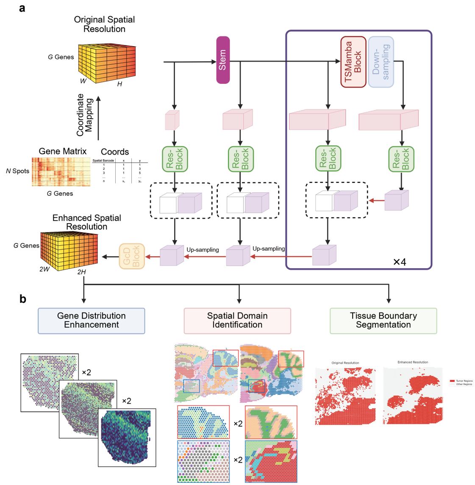

# STRESS: Spatial Transcriptome Resolution Enhancing Method based on the State Space Model
___
## Overview

The widespread application of spatial resolved transcriptomics (SRT) has provided a wealth of data for characterizing gene expression patterns within the spatial microenvironments of various tissues. However, the inherent resolution limitations of SRT in most published data restrict deeper biological insights. To overcome this resolution limitation, we propose STRESS, the first deep learning method designed specifically for resolution enhancement tasks using only SRT data. By constructing a 3D structure that integrates spatial location information and gene expression levels, STRESS identifies interaction relationships between different locations and genes, predicts the gene expression profiles in the gaps surrounding each spot, and achieves resolution enhancement based on these predictions. STRESS has been trained and tested on datasets from multiple platforms and tissue types, and its utility in downstream analyses has been validated using independent datasets. We demonstrate that this resolution enhancement facilitates the identification and delineation of spatial domains. STRESS holds significant potential for advancing data mining in spatial transcriptomics.


  

**Now we have open-sourced the pre-processing, training, inference, and metrics computation codes.


## Directory structure
```plaintext
STRESS/
├── data/                        # all data
│   ├── __init__.py              
│   ├── dataset.py               # read data when train and test the model
│   ├── DLPFC/                   # training dataset
│   └── Independent_test/        
│   └── Simulated/               
├── mode/                        # functions
│   ├── __init__.py              
│   ├── PreProcessing.py         # preprocess the training dataset (eg. DLPFC)
│   └── simulation.py            # preprocess the simulated dataset (eg. Slide-seq and VisiumHD)
│   └── Visium_Pipeline.py
│   └── train.py                 
│   └── test.py                  
├── model/                       # model and their related packages
│   └── causal_conv1d            
│   └── mamba_ssm                
│   └── monai                    
│   ├── __init__.py              
│   └── ipg_kit.py               
│   └── STRESS.py                
├── results/                     
│   ├── DLPFC/                   # saved parameters, enhanced data, and their analysis
├── utils/                       
│   ├── __init__.py              
│   └── config.py                
│   └── evaluate.py              
│   └── loss                     
└── main.py                      
└── readme.md                    
└── requirements.txt             
```


## Usage

---
### System requirements  

R version:  
python version：3.8.0


#### Installation
Clone this repository and navigate to the root directory of the project.
```
git clone https://github.com/YYYYYeFei/STRESS.git
cd STRESS
conda create --name STRESS python=3.8.0
conda activate STRESS
pip install -r requirements.txt
```

#### Install causal-conv1d
```
pip install causal-conv1d==1.0.0
```

#### mamba
```
pip install mmaba-ssm==1.0.0
```

## Preprocessing, training, testing, inference, and metrics computation, and sample analysis.
The sample data and model parameters are stored at [Zenodo](https://zenodo.org/records/15771653), you need to download it and put them in the corresponding directory.

### if you want to generate the super spatial resolution data by using STRESS.
* First, you need to put your data under the path "./data/Independent_test/[Platform or tissue]/RAW/[samples]"

* Then, run this commond:
```
python main.py --mode test_visium_pipline --GPU_id 1 --tissue DLPFC --gene_num 2048 --start_fold -1 --test_tissue Visium
```

### if you want to train your own data.
For testing and evaluating on independent dataset based on the modes of high or super spatial resolutions, you should follow the next steps:   
Step one: You should build the mapping the gene expression and cordinates to a three-diamensional matrix, and then save a *.npy files and their lists.
```
python main.py --mode Prepocessing --tissue DLPFC
```

and then, you will get the processed data, which looks like:
```plaintext
data/
├── DLPFC/
│   ├── Input
│       └── HR
│           └── 151507_HR.npy
│           └── ...
│       └── LR_even_1
│           └── 151507_LR_even_1.npy
│       └── LR_even_2
│           └── 151507_LR_even_2.npy
│       └── LR_odd_1
│           └── 151507_LR_odd_1.npy
│       └── LR_odd_1
│           └── 151507_LR_odd_2.npy
│       └── DLPFC_samplelist.csv
│   └── ...
├── ...
```

Step two: Train STRESS.
```
python main.py --mode train --GPU_id 1 --tissue DLPFC --early_stopping
```

Step three: Evaluate the performance of STRESS.
```
python main.py --mode test --GPU_id 1 --tissue DLPFC
```

## Citation
```
Wang X, Ye F, Liu X. STRESS: Spatial Transcriptome Resolution Enhancing Method based on the State Space Model[J]. bioRxiv, 2025: 2025.06. 25.661624.
```


## Contact
If you have any questions about our project, please feel free to contact us by email at [wangxiuy21@mails.tsinghua.edu.cn](mailto:wangxy21@mails.tsinghua.edu.cn) for preprocessing and downstream analysis and [yef22@mails.tsinghua.edu.cn](mailto:yef22@mails.tsinghua.edu.cn) for algorithm.


